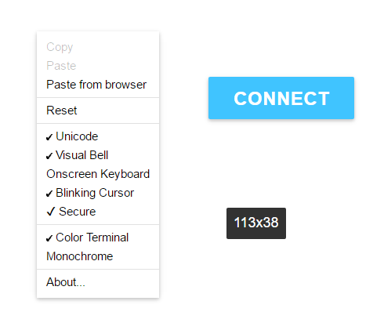

# shellinabox-md-style
A little CSS replacement for shellinabox to theme it with Google's Material Design language and make it more pretty

## Some images

## Use

Just copy [00+Black on White.css](00+Black on White.css) to `/etc/shellinabox/options-enabled/` (replacing what's in there).

You'll also have to restart shellinabox with `/etc/init.d/shellinabox restart`.

## Credits

Thanks to the [Materialize framework](https://github.com/Dogfalo/materialize) for creating some of the styles I adapted.
